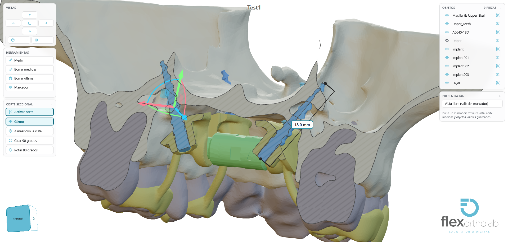

<div align="center">

# Flex Ortho Lab · Visor 3D

**Visor profesional de modelos dentales para laboratorios y clínicas.**  
Revisa, mide y presenta diseños 3D directamente en el navegador, sin instalar nada.

[](LICENSE)
[](https://vitejs.dev/)
[](https://threejs.org/)
[]()

</div>

<p align="center">
  
</p>


## Pruébalo ahora

Abre el visor con nuestro modelo de ejemplo en GitHub Pages:

🔗 **[https://flexortholab.github.io/model-viewer-frontend/viewer.html?model=samples/Test1.glb](https://flexortholab.github.io/model-viewer-frontend/viewer.html?model=samples/Test1.glb)**

Carga el modelo, gira libremente, activa el corte, mide distancias o prueba la presentación de marcadores. Todo funciona en escritorio, tableta y móvil.

## ¿Qué es?

Flex Ortho Lab · Visor 3D es una aplicación web pensada para el flujo de trabajo digital en ortodoncia y prótesis dentales:

- El **laboratorio** sube el caso y prepara la presentación (vistas, cortes, medidas y marcadores).
- El **doctor** recibe un enlace, abre el visor y revisa el caso paso a paso, con la misma precisión con la que fue preparado.

Diseñado originalmente para **disyuntores sinterizados con anclaje esquelético**, pero compatible con cualquier modelo 3D estático en los formatos más comunes.

## Características principales

- **Cámara ortográfica** sin distorsión de perspectiva, ideal para anatomía y mediciones exactas.
- **Vistas predefinidas** (superior, inferior, frontal, trasera, laterales e isométrica) más cubo de navegación interactivo.
- **Corte seccional** con plano único y gizmo visual (mover + rotar) para inspeccionar el interior del modelo.
- **Capping sólido** por pieza: el corte se ve macizo, no como una malla hueca, con curva de contorno exacta.
- **Mediciones de precisión** en milímetros, editables directamente sobre la pieza, con anotaciones y notas.
- **Marcadores de presentación** que guardan y restauran vista, corte, medidas y visibilidad de objetos. El doctor solo tiene que pulsar cada paso.
- **Lista de objetos** para mostrar u ocultar piezas individualmente.
- **Modo móvil** simplificado con barra inferior: Inicio, Objetos y Presentación.
- **Embebible** en cualquier plataforma mediante iframe y protocolo `postMessage`.
- **Marca personalizable** desde un único fichero (`src/brand.js`): nombre, logo y color corporativo.
- **Software libre** bajo licencia GPL-3.0-or-later.

## Formatos soportados

`GLB` · `glTF` · `STL` · `OBJ` · `FBX` · `3MF`

Se recomienda exportar desde Blender en **GLB 2.0** (soporta compresión Draco, texturas KTX2/Basis y Meshopt).

## Arranque rápido

```bash
npm install
npm run dev
```

Abre el enlace que aparece (normalmente `http://localhost:5173`) o ejecuta directamente:

```bash
Iniciar-Visor-dev.bat
```

### Comandos útiles

| Comando | Qué hace |
|---|---|
| `npm run dev` | Servidor de desarrollo con recarga en caliente |
| `npm run build` | Build de producción en `dist/` |
| `npm run preview` | Sirve el build localmente |
| `npm test` | Tests unitarios |
| `npm run test:e2e` | Tests de navegador con Playwright ( Chromium, Firefox, WebKit, Edge ) |
| `npm run sample` | Genera modelos STL de ejemplo |

## Personalización de marca

Todo el aspecto visual centralizado está en `src/brand.js`:

| Elemento | Dónde cambiar |
|---|---|
| Nombre y título de la pestaña | `BRAND.name` / `BRAND.title` |
| Logo de la esquina | `public/logo.svg` y `BRAND.logo` |
| Color corporativo | `BRAND.accent` (ej. `#63bbd4`) |

## Licencia

Este proyecto es **software libre** distribuido bajo la licencia **GPL-3.0-or-later**.  
Puedes usarlo, modificarlo y compartirlo, incluso con fines comerciales, siempre que mantengas la misma licencia y el código fuente disponible. Consulta el fichero [`LICENSE`](LICENSE) para los detalles completos.

---

<p align="center">
  <strong>Flex Ortho Lab</strong> · Laboratorio digital · <a href="https://flexortholab.github.io/model-viewer-frontend/viewer.html?model=samples/Test1.glb">Demo en vivo</a>
</p>
